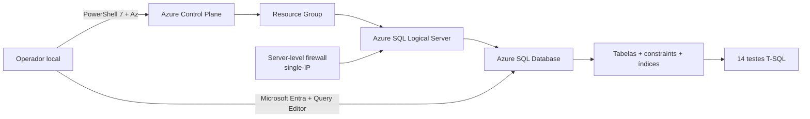

# DIO Azure SQL Secure Lab

Laboratório de provisionamento, hardening, validação e governança de Azure SQL Database com PowerShell, Az PowerShell, T-SQL e Microsoft Entra.

O projeto demonstra automação defensiva, validação fail-closed, segurança de rede, autenticação Entra-only, proteção de operações destrutivas, seed transacional/idempotente e testes automatizados de segurança no banco de dados.

> **Escopo:** laboratório educacional e de portfólio. Não é uma arquitetura de referência para produção.

## Resultados validados

- TLS mínimo 1.2;
- TDE habilitado;
- Microsoft Entra-only;
- Azure SQL Database Serverless com Free Limit e AutoPause;
- uma única regra server-level limitada a um único IPv4;
- ausência de `Allow Azure Services`;
- zero regras database-level de firewall na database `master` e na database do laboratório;
- seed executado duas vezes sem duplicação;
- três assets e quatro eventos após ambas as execuções;
- suíte SQL com **14 PASS / 0 FAIL**;
- validação Azure com **0 falhas / 0 avisos**.

## Finalidade

1. validar ferramentas antes de alterar o ambiente;
2. autenticar e selecionar explicitamente o contexto Azure;
3. planejar alterações antes de aplicá-las;
4. validar a subscription antes de operações sensíveis;
5. exigir baseline de segurança para recursos existentes;
6. restringir acesso público por firewall single-IP;
7. validar infraestrutura e banco de dados separadamente;
8. proteger operações destrutivas com múltiplos guardrails;
9. evitar credenciais, PII e identificadores sensíveis em código e evidências;
10. manter histórico Git auditável antes da publicação.

## Arquitetura resumida



Detalhes: [`docs/arquitetura/arquitetura.md`](docs/arquitetura/arquitetura.md).

## Estrutura

```text
.
├── README.md
├── SECURITY.md
├── .gitignore
├── docs
│   ├── arquitetura
│   │   └── arquitetura.md
│   └── evidencias
│       └── README.md
├── infra
│   └── powershell
│       ├── 00-prerequisites.ps1
│       ├── 01-connect-azure.ps1
│       ├── 02-deploy.ps1
│       ├── 03-validate.ps1
│       ├── 04-firewall.ps1
│       └── 99-destroy.ps1
└── sql
    ├── 01-schema.sql
    ├── 02-seed.sql
    └── 03-security-tests.sql
```

## Requisitos

- PowerShell 7 ou superior;
- módulo `Az` com os cmdlets requeridos;
- conta e subscription Azure adequadas ao laboratório;
- Microsoft Entra;
- Azure SQL Query Editor ou cliente compatível com Entra;
- Git.

Valide o ambiente:

```powershell
.\infra\powershell\00-prerequisites.ps1
```

## Instalação

A URL do repositório só deve ser publicada após a auditoria de segurança.

```powershell
git clone <REPOSITORY_URL>
cd dio-azure-sql-secure-lab
```

## Configuração segura

Não grave no código: Subscription ID, Tenant ID, Object ID, e-mail pessoal, IP, token, senha, chave, connection string, cookie ou segredo.

Autentique:

```powershell
.\infra\powershell\01-connect-azure.ps1
```

Carregue o Subscription ID somente na sessão local:

```powershell
$ExpectedSubscriptionId = Read-Host "Informe localmente o Subscription ID esperado"

if ([string]::IsNullOrWhiteSpace($ExpectedSubscriptionId)) {
    throw "SECURITY: ExpectedSubscriptionId não informado."
}

Write-Host "[OK] Subscription ID carregado apenas na sessão local."
Write-Host "[SECURITY] Não capture nem publique o terminal que recebeu esse valor."
```

## Uso

### Deployment em dry-run

```powershell
.\infra\powershell\02-deploy.ps1 `
    -ResourceGroupName "<RESOURCE_GROUP_NAME>" `
    -ServerName "<SQL_SERVER_NAME>" `
    -DatabaseName "<DATABASE_NAME>" `
    -ExpectedSubscriptionId $ExpectedSubscriptionId
```

Sem `-Apply`, o script não cria ou altera recursos.

### Aplicação

Para servidor ausente, forneça o administrador Entra somente em runtime:

```powershell
$ExternalAdminName = Read-Host "Informe o nome do administrador Entra"
$ExternalAdminSid  = Read-Host "Informe o Object ID do administrador Entra"

.\infra\powershell\02-deploy.ps1 `
    -ResourceGroupName "<RESOURCE_GROUP_NAME>" `
    -ServerName "<SQL_SERVER_NAME>" `
    -DatabaseName "<DATABASE_NAME>" `
    -ExpectedSubscriptionId $ExpectedSubscriptionId `
    -ExternalAdminName $ExternalAdminName `
    -ExternalAdminSid $ExternalAdminSid `
    -Apply
```

### Validação

```powershell
.\infra\powershell\03-validate.ps1 `
    -ResourceGroupName "<RESOURCE_GROUP_NAME>" `
    -ServerName "<SQL_SERVER_NAME>" `
    -DatabaseName "<DATABASE_NAME>" `
    -ExpectedSubscriptionId $ExpectedSubscriptionId
```

Resultado validado:

```text
Falhas: 0
Avisos: 0
```

### Firewall

Auditoria:

```powershell
.\infra\powershell\04-firewall.ps1 `
    -ResourceGroupName "<RESOURCE_GROUP_NAME>" `
    -ServerName "<SQL_SERVER_NAME>" `
    -ExpectedSubscriptionId $ExpectedSubscriptionId `
    -Mode Audit
```

Ensure em dry-run:

```powershell
.\infra\powershell\04-firewall.ps1 `
    -ResourceGroupName "<RESOURCE_GROUP_NAME>" `
    -ServerName "<SQL_SERVER_NAME>" `
    -ExpectedSubscriptionId $ExpectedSubscriptionId `
    -Mode Ensure `
    -RuleName "<RULE_NAME>" `
    -ClientIpAddress "<CLIENT_IPV4>"
```

### SQL

Execute na database do laboratório:

```text
sql/01-schema.sql
sql/02-seed.sql
sql/03-security-tests.sql
```

O seed foi executado duas vezes e permaneceu em:

```text
ExpectedLabAssets       = 3
ExpectedSecurityEvents  = 4
```

A suíte retornou **14 PASS / 0 FAIL**.

### Cleanup protegido

Dry-run:

```powershell
.\infra\powershell\99-destroy.ps1 `
    -ResourceGroupName "<RESOURCE_GROUP_NAME>" `
    -ServerName "<SQL_SERVER_NAME>" `
    -DatabaseName "<DATABASE_NAME>" `
    -ExpectedSubscriptionId $ExpectedSubscriptionId
```

Simulação explícita:

```powershell
.\infra\powershell\99-destroy.ps1 `
    -ResourceGroupName "<RESOURCE_GROUP_NAME>" `
    -ServerName "<SQL_SERVER_NAME>" `
    -DatabaseName "<DATABASE_NAME>" `
    -ExpectedSubscriptionId $ExpectedSubscriptionId `
    -ConfirmationText "<RESOURCE_GROUP_NAME>" `
    -Apply `
    -WhatIf
```

## Segurança

Principais controles:

- `ExpectedSubscriptionId`;
- consultas fail-closed;
- TLS 1.2;
- Microsoft Entra-only;
- TDE;
- firewall single-IP;
- bloqueio de `Allow Azure Services`;
- zero regras database-level na database `master` e na database do laboratório;
- seed transacional/idempotente;
- 14 testes SQL;
- inventário/allowlist antes do cleanup;
- Resource Lock check;
- confirmação textual;
- `ShouldProcess` e `WhatIf`;
- política de `noreply`;
- auditoria de histórico antes do push.

Consulte [`SECURITY.md`](SECURITY.md).

## Evidências

Critérios e processo: [`docs/evidencias/README.md`](docs/evidencias/README.md).

Nunca publique capturas contendo e-mail, Subscription ID, Tenant ID, Object ID, IP, caminho local, URL completa do Azure Portal, cookies, tokens, chaves, connection strings ou identificadores de sessão.

## Limitações

- endpoint público no cenário validado;
- sem Private Endpoint;
- sem VNet integration;
- sem Azure Policy;
- sem Defender for SQL como requisito;
- sem Log Analytics/SIEM;
- sem CI/CD;
- sem Key Vault;
- não substitui RBAC/PIM/políticas corporativas;
- disponibilidade da oferta depende da subscription/região;
- nomes e identificadores reais não devem ser reutilizados em documentação pública.

## Boas práticas antes do push

```powershell
git diff --check
git status --short
```

Além disso:

- audite arquivos rastreados;
- audite histórico;
- audite autor/committer;
- audite branches/tags;
- audite reflogs/objetos antigos;
- confirme GitHub `noreply`;
- sanitize evidências;
- valide o remote;
- execute o checklist final.

## Documentação

- [Modelo de segurança](SECURITY.md)
- [Arquitetura](docs/arquitetura/arquitetura.md)
- [Evidências](docs/evidencias/README.md)

## Licença

Nenhuma licença é presumida. Adicione uma licença explicitamente se decidir publicar o projeto sob uma licença específica.
