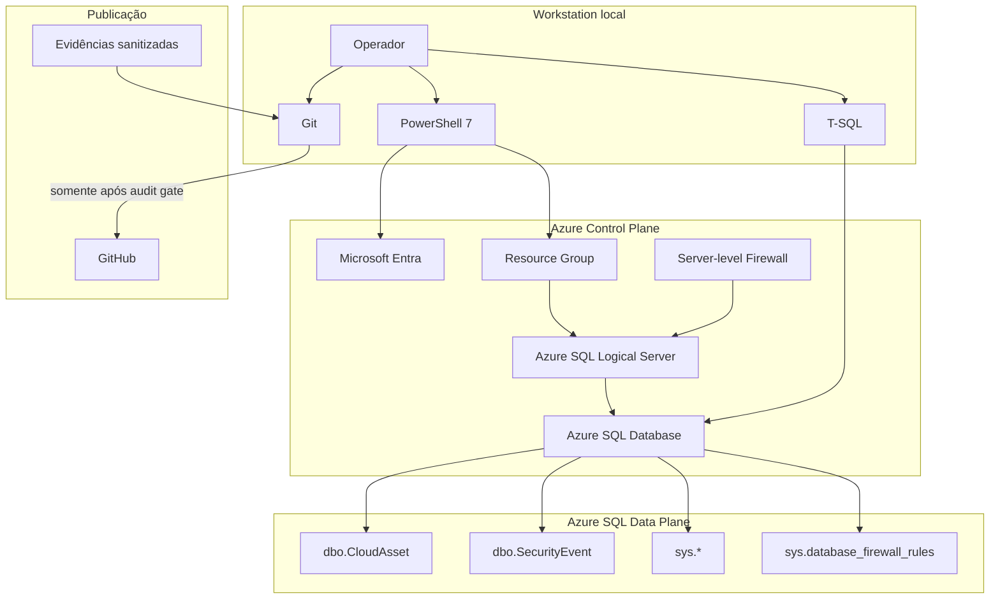
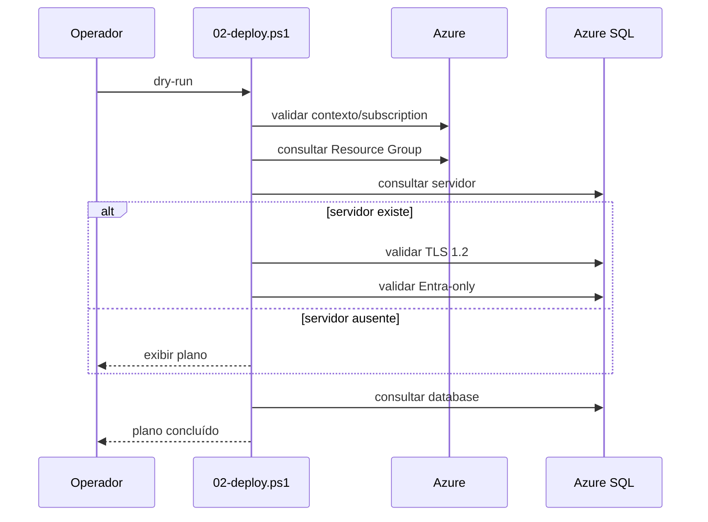
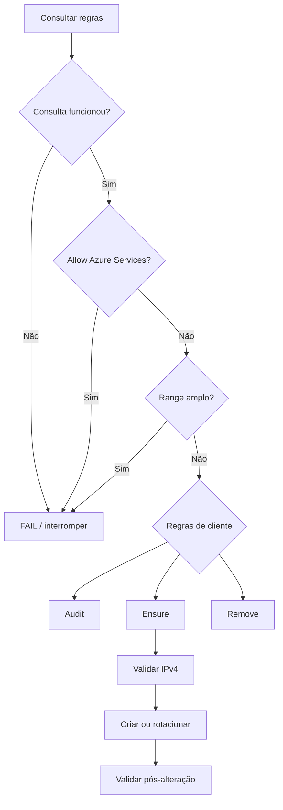
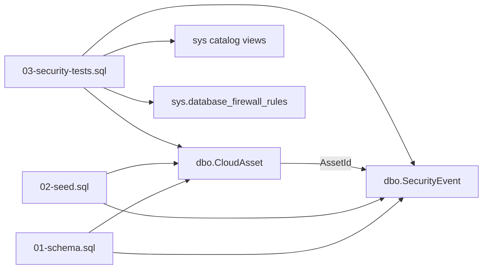

# Arquitetura — DIO Azure SQL Secure Lab

## Objetivo

Descrever componentes, dependências, fronteiras de confiança, fluxo técnico e fluxo de dados do laboratório.

## Visão geral

O projeto separa responsabilidades em três camadas:

1. automação de infraestrutura com PowerShell e Az;
2. configuração/validação de dados com T-SQL;
3. controle de publicação com Git/GitHub e política de evidências.

## Diagrama



## Componentes

### `00-prerequisites.ps1`

Valida PowerShell, módulo Az, cmdlets e parâmetros necessários. Não cria recursos.

### `01-connect-azure.ps1`

Autentica, permite selecionar a subscription, define contexto e confirma a subscription ativa. Não foi projetado para gravar senha, token ou segredo.

### `02-deploy.ps1`

- dry-run por padrão;
- valida `ExpectedSubscriptionId`;
- consultas fail-closed;
- cria somente com `-Apply`;
- valida TLS 1.2 e Entra-only em servidor existente;
- aplica propriedades esperadas ao banco;
- usa tags de governança.

### `03-validate.ps1`

Audita:

- contexto;
- região;
- servidor;
- TLS;
- database;
- tier/objective;
- capacidade;
- auto-pause;
- tamanho;
- backup redundancy;
- TDE;
- Free Limit;
- Entra-only;
- Public Network Access;
- server-level firewall;
- tags.

Falha de consulta não é interpretada como estado seguro.

### `04-firewall.ps1`

- audita regras;
- rejeita `Allow Azure Services`;
- rejeita ranges;
- aplica política de uma regra single-IP;
- cria/rotaciona;
- valida pós-alteração;
- não imprime o IP;
- protege a remoção da última regra.

### `99-destroy.ps1`

Antes da exclusão:

- valida contexto e subscription;
- valida recursos esperados;
- valida databases permitidas;
- valida tags;
- inventaria o Resource Group;
- compara com allowlist;
- bloqueia recursos inesperados;
- verifica Resource Locks;
- exige confirmação textual;
- usa `ShouldProcess`;
- suporta `WhatIf`.

## Camada SQL

### `01-schema.sql`

Cria condicionalmente `dbo.CloudAsset`, `dbo.SecurityEvent`, PKs, FK, CHECK constraints e índices. Não usa `DROP TABLE`.

### `02-seed.sql`

- dados fictícios;
- transação;
- `XACT_ABORT`;
- `TRY/CATCH`;
- rollback;
- `IF NOT EXISTS`;
- IDs resolvidos pelo banco.

Idempotência validada:

```text
1ª execução: 3 assets / 4 events
2ª execução: 3 assets / 4 events
```

### `03-security-tests.sql`

Executa 14 controles:

1. database context;
2. expected tables;
3. primary keys;
4. foreign key;
5. CHECK constraints;
6. indexes;
7. seed assets;
8. security events;
9. duplicate assets;
10. duplicate events;
11. referential integrity;
12. Environment domain;
13. Severity domain;
14. current database firewall.

Resultado validado:

```text
14 PASS
0 FAIL
```

## Dependências

```text
Operador
  ↓
PowerShell 7
  ↓
Az PowerShell
  ↓
Microsoft Entra / Azure Resource Manager
  ↓
Azure SQL
```

Data plane:

```text
Microsoft Entra
  ↓
Azure SQL Query Editor / cliente compatível
  ↓
database do laboratório
  ↓
T-SQL
```

## Fronteiras de confiança

### TB-01 — estação local ↔ Microsoft Entra

Riscos: credenciais, tokens, Tenant/Object IDs.

Controle: autenticação interativa e nenhuma persistência deliberada no Git.

### TB-02 — estação local ↔ Azure Control Plane

Risco: operação na subscription errada.

Controle: `ExpectedSubscriptionId`, validação do contexto e fail-closed.

### TB-03 — cliente ↔ Azure SQL public endpoint

Risco: exposição de rede.

Controle validado: uma regra server-level, single-IP, sem `Allow Azure Services` e zero regras database-level na database `master` e na database do laboratório.

Limitação: endpoint público.

### TB-04 — Git local ↔ GitHub

Risco: publicação de PII, segredo ou histórico antigo.

Controle: `noreply`, scans, sanitização, limpeza de reflogs/objetos, remote gate e pre-push gate.

## Fluxo de deployment



## Fluxo de firewall



## Fluxo de dados



## Invariantes

- subscription validada em operações sensíveis;
- TLS 1.2;
- Entra-only;
- TDE;
- sem `Allow Azure Services`;
- firewall cliente single-IP;
- zero regra database-level inesperada na database `master` e na database do laboratório;
- recurso inesperado bloqueia cleanup;
- evidência pública sem PII/segredo;
- push somente depois do gate.

## Tags

- `Environment=Lab`
- `Project=dio-azure-sql-secure-lab`
- `Purpose=Learning`
- `DataClassification=NonSensitive`
- `Lifecycle=Temporary`

## Decisões arquiteturais

### AD-01 — PowerShell

Repetibilidade, auditabilidade, dry-run e guardrails.

### AD-02 — Entra-only

Evita dependência de autenticação SQL persistida.

### AD-03 — single-IP com endpoint público

Compatível com o laboratório, mas não equivale a rede privada.

### AD-04 — seed idempotente

Permite repetição segura e prova de não duplicação.

### AD-05 — cleanup fail-closed

Ambiguidade bloqueia exclusão.

### AD-06 — audit gate antes do GitHub

Remover dados do HEAD não garante remoção de histórico, reflogs ou objetos.

## Limitações

- sem Private Endpoint/VNet;
- sem CI/CD;
- sem Key Vault;
- sem SIEM;
- sem Azure Policy;
- sem garantia de conformidade;
- dependente da subscription/região;
- laboratório de escopo controlado.

## Evoluções

- Bicep/Terraform;
- Private Endpoint;
- GitHub Actions;
- secret scanning;
- Pester;
- testes SQL em pipeline;
- Azure Policy;
- Key Vault;
- observabilidade.
